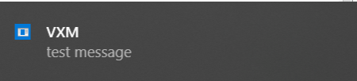

# Yii2 Desktop Notifier

[](https://packagist.org/packages/vxm/yii2-desktop-notifier)
[](https://packagist.org/packages/vxm/yii2-desktop-notifier)
[](https://travis-ci.org/vuongxuongminh/yii2-desktop-notifier)
[](https://scrutinizer-ci.com/g/vuongxuongminh/yii2-desktop-notifier/?branch=master)
[](https://scrutinizer-ci.com/g/vuongxuongminh/yii2-desktop-notifier/?branch=master)
[](http://www.yiiframework.com/)

## About it

An extension support send desktop notify base on [JoliNotif](https://github.com/jolicode/JoliNotif) wrapper for Yii2 console controller. Works on Linux, Windows & MacOS.

## Requirements

* [PHP >= 7.1](http://php.net)
* [yiisoft/yii2 >= 2.0.13](https://github.com/yiisoft/yii2)

## Installation

Require Yii2 desktop notifier using [Composer](https://getcomposer.org):

```bash
composer require vxm/yii2-desktop-notifier
```


## Usage

<p align="center">
    
</p>

```php

use yii\console\Controller;

/**
 * @method void desktopNotify(string $title, string $body, $icon = null)
 */
class TestController extends Controller
{
    public function actionTest()
    {
        $this->desktopNotify('VXM', 'test message');
    }
}
```
